# 教程：5分钟上手 XCharts 3.0

## 获取和导入 XCharts

XCharts可通过以下任意一种方式导入到项目：

- 直接将XCharts源码到项目

   下载好XCharts源码后，直接将XCharts目录拷贝到Unity项目工程的Assets目录或Packages目录下，编译通过后即可使用。

- 通过`Assets/Import Package`导入XCharts

   下载好XCharts的.unitypackage文件后，打开Unity，菜单栏 Assets-->Import Package-->选中.unitypackage导入即可开始使用XCharts。

- 通过`Package Manager`导入XCharts

   对于Unity 2018.3以上版本，可通过 Package Manager来导入XCharts，打开Package Manager后，通过 `Add package form git URL...`，输入XCharts3.0的GitHub URL: `https://github.com/XCharts-Team/XCharts.git#3.0` 稍等片刻后即可使用XCharts。

   也可以直接将package加入到`manifest.json`文件：打开`Packages`目录下的`manifest.json`文件，在`dependencies`下加入：

    ``` json
        "com.monitor1394.xcharts": "https://github.com/XCharts-Team/XCharts.git#3.0",
    ```

    如需更新`XCharts`，删除`manifest.json`文件（部分Unity版本可能是packages-lock.json文件）的`lock`下的`com.monitor1394.xcharts`相关内容即会重新下载编译。

## 添加一个简单图表

在`Hierarchy`视图下右键或菜单栏`GameObject`下拉选择`XCharts->LineChart`，即可快速创建一个默认的折线图出来：

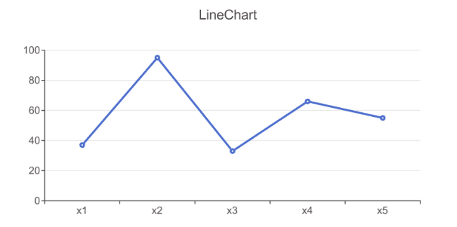

## 添加多个Seire

在`Inspector`视图，找到`LineChart`的面板，通过`Add Serie`按钮，可以添加第二条`Line`折线：

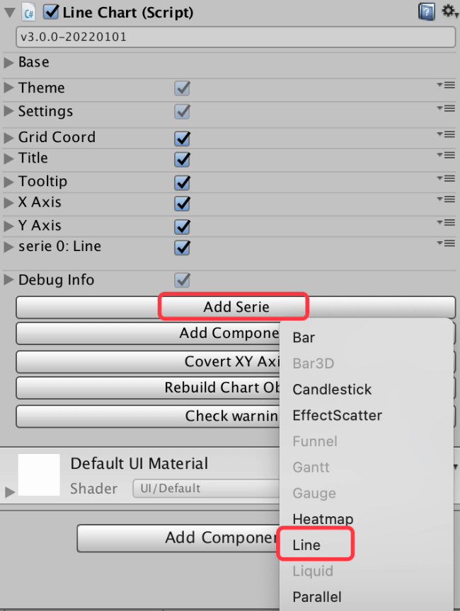
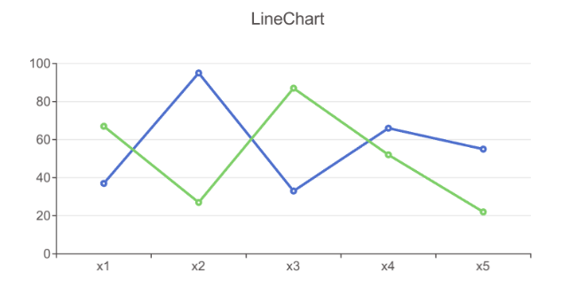

## 添加其他组件

默认图表没有`Legend`，需要`Legend`组件可通过`Add Component`按钮添加：

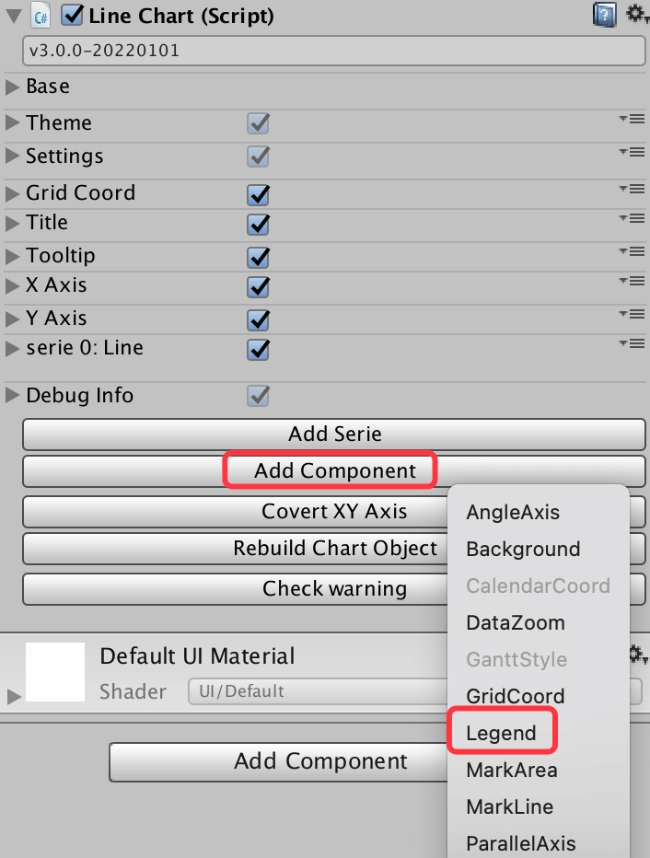

## 添加Serie组件

Serie只自带了几个常见的组件，其他组件要根据需求额外添加，不同的Serie支持不同的额外组件。比如，需要给折线图区域填充颜色，可单独给`Serie`添加`AreaStyle`组件：

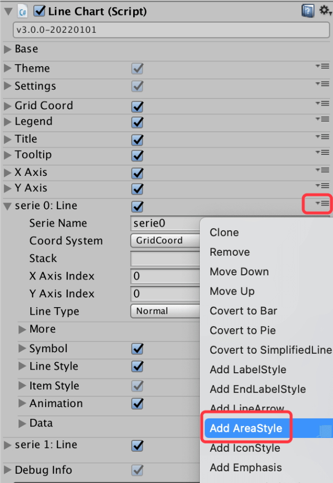
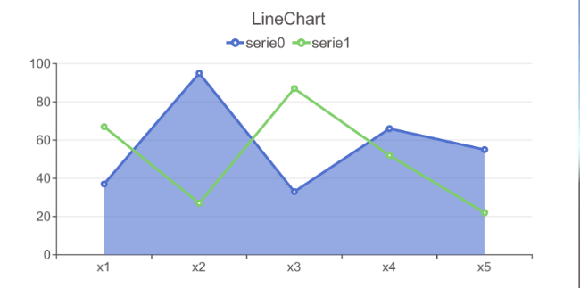

## 添加SerieData组件

如果需要个性化定制每个数据项的配置，可以单独给每个`SerieData`添加`Component`。比如我们给折线图的第二个数据单独显示`Label`：

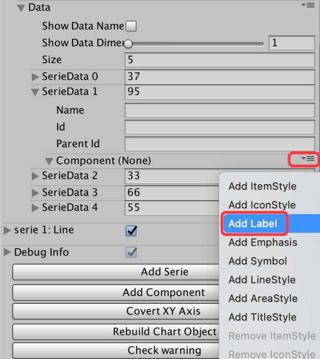
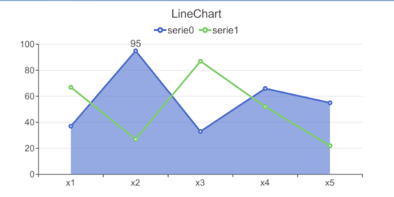

## 更多组件和配置参数

功能越丰富就越需要更多的组件和参数支持。XCharts有多达几十种的主组件和子组件，每个组件有几个至几十个不等的可配置参数，以支持各种灵活而复杂的功能。

首次接触XCharts者可在 `Inspector` 视图下可以添加和调整各个组件，`Game` 视图会实时反馈调整的效果，以熟悉各种组件实现的效果。各个组件的详细参数说明可查阅[XCharts配置项手册](configuration.md)。

## 如何快速调整参数

`XCharts`是配置参数驱动。想要什么效果，你只需要去调整对应组件下的配置参数就可以，不需要去改`Hierarchy`视图下的节点，因为那些节点是由`XCharts`内部根据配置参数生成的，即使改了也会在刷新时被还原回来。

快速定位你想要改的效果对应的组件。这就需要对组件有一定的了解。比如我们想要让X轴的轴线末端显示箭头，如何定位？第一步，X轴定位到`XAxis0`；第二步，轴线定位到`AxisLine`；最后，再去看`AxisLine`组件下有没有这样的参数可以实现这个效果。

`XCharts`提供从全局`Theme`、系列`Serie`、单个数据项`SerieData`全方位的参数配置。优先级从大到小为：`SerieData`->`Serie`->`Theme`。以`ItemStyle`的颜色为例：

1. 如果`SerieData`的`ItemStyle`配置有非`0000`颜色值，则优先用这个颜色值。
2. 如果`Serie`的`ItemStyle`配置有非`0000`颜色值，则优先用这个颜色值。
3. 否则颜色值取自主题`Theme`的`Color Palette`。

通常配置的颜色值为0000时表示用主题默认颜色；配置参数的值为0或null时表示用主题默认配置。

## 用代码添加折线图

给`gameObject`挂上`LineChart`脚本：

```C#
var chart = gameObject.GetComponent<LineChart>();
if (chart == null)
{
    chart = gameObject.AddComponent<LineChart>();
    chart.Init();
}
```
用代码生成的Chart需要调用一次Init()。

调整大小：

```C#
chart.SetSize(580, 300);//代码动态设置尺寸，或直接操作chart.rectTransform，或直接在Inspector上改
```

设置标题：

```C#
var title = chart.EnsureChartComponent<Title>();
title.text = "Simple Line";
```

设置提示框和图例是否显示：

```C#
var tooltip = chart.EnsureChartComponent<Tooltip>();
tooltip.show = true;

var legend = chart.EnsureChartComponent<Legend>();
legend.show = false;
```

设置坐标轴：

```C#
var xAxis = chart.EnsureChartComponent<XAxis>();
xAxis.splitNumber = 10;
xAxis.boundaryGap = true;
xAxis.type =  Axis.AxisType.Category;

var yAxis = chart.EnsureChartComponent<YAxis>();
yAxis.type =  Axis.AxisType.Value;
```

清空默认数据，添加`Line`类型的`Serie`用于接收数据：

```C#
chart.RemoveData();
chart.AddSerie<Line>("line");
```

添加10个数据：

```C#
for (int i = 0; i < 10; i++)
{
    chart.AddXAxisData("x" + i);
    chart.AddData(0, Random.Range(10, 20));
}
```

这样一个简单的折线图就出来了：

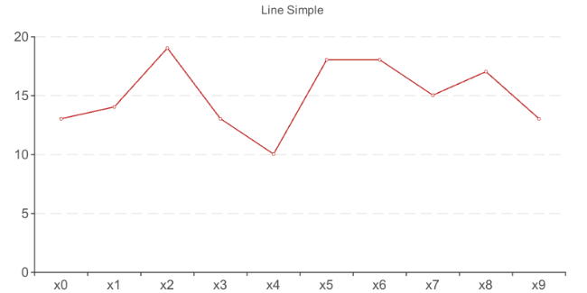

如果一个Chart里面有多个系列时，则Axis的data只需要加一次，不要多个循环加重复了。记住：Axis的数据个数要和Serie的数据个数一致。

完整代码请查阅`Examples`：`Example13_LineSimple.cs`  

你还可以用代码控制更多的参数，`Examples`下还有更多的其他例子，凡是`Inspector`上看到的可配置的参数，都可以通过代码来设置。[XCharts配置项手册](configuration.md)里面的所有参数都是可以通过代码控制的。

另外，除非定制，建议调用`Chart`下提供的`public`接口，特别是数据相关操作部分。这些接口内部会做一些关联处理，比如刷新图表等。常见的接口有：

1. `chart.ClearData()`：清空图表数据（不移除Series）
2. `chart.RemoveData()`：清除图表数据（会移除所有Serie）
3. `chart.AddSerie()`：添加Serie
4. `chart.AddXAxisData()`：添加X轴数据
5. `chart.AddData()`：添加Serie数据
6. `chart.UpdateData()`：更新Serie数据
7. `chart.UpdateXAxisData()`：更新X轴数据
8. `chart.UpdateDataName()`：更新Serie数据的名字

XCharts内部有自动刷新机制，但也是在一定条件下。如果自己调用了内部组件的接口，碰到组件没有刷新，确实找不到原因的话，可以用以下两个接口强制刷新：

1. `chart.RefreshAllComponent()`：刷新图表组件，会重新初始化所有组件，不建议频繁使用。
2. `chart.RefreshChart()`：刷新图表绘制，只刷新绘制部分，不会刷新组件文本，位置等部分。

## 使用TextMeshPro

XCharts支持TextMeshPro，但默认是不开启的，需要自己手动切换。可通过以下方式开启和关闭：

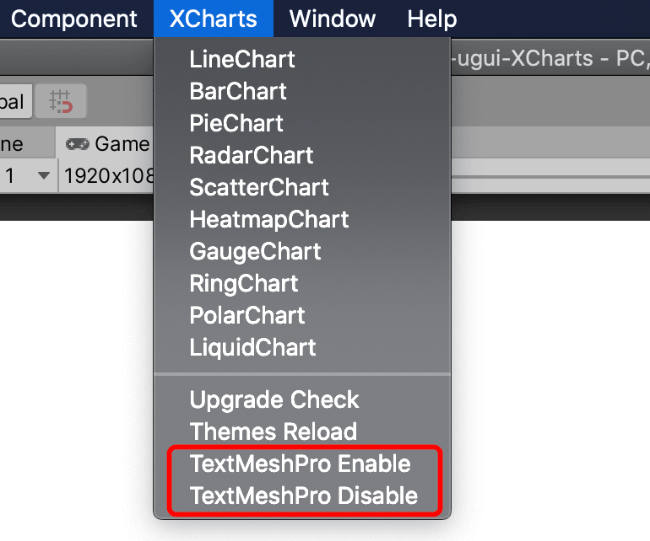

开启后需要设置好TextMeshPro要用的全局字体，也可以在主题Theme里单独设置：

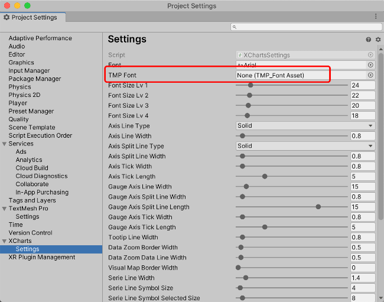

建议在项目初就规划好是否使用TextMeshPro，并设置好字体。在已有很多图表的情况下切换TMP时，可能某些图表无法自动刷新，可以手动点击`Rebuild Chart Object`按钮来重建图表，即可正常初始化。

开启了TMP项目在更新XCharts时，可能会碰到丢失了TMP引用而无法编译通过的问题，可通过以下两种方式解决：

1. 找到`XCharts.Runtime.asmdef`和`XCharts.Editor.asmdef`，手动加上 `TextMeshPro`的引用
2. 移除`PlayerSetting`中`Scripting Define Symbols`的`dUI_TextMeshPro`宏

## 用代码改图表参数

`Inspector`上看到的所有参数都可以用代码来修改，关键是要定位好你要改的参数是在组件上、还是serie上、还是在具体的数据项上改。

### 改主组件上的参数

需要先获取组件，再修改里面的参数：

```C#
var title = chart.EnsureChartComponent<Title>();
title.text = "Simple LineChart";
title.subText = "normal line";

var xAxis = chart.EnsureChartComponent<XAxis>();
xAxis.splitNumber = 10;
xAxis.boundaryGap = true;
xAxis.type = Axis.AxisType.Category;
```

### 改Serie的参数

新添加的Serie：

```C#
var serie = chart.AddSerie<Pie>();
serie.center[0] = 0.5f;
serie.center[1] = 0.5f;
serie.radius[0] = 80;
serie.radius[1] = 90;
serie.animation.dataChangeEnable = true;
serie.roundCap = true;
```

已存在的Serie：

```C#
var serie = chart.GetSerie<Pie>();
serie.center[0] = 0.5f;
serie.center[1] = 0.5f;
serie.radius[0] = 80;
serie.radius[1] = 90;
serie.animation.dataChangeEnable = true;
serie.roundCap = true;
```

给Serie添加额外组件：

```C#
serie.EnsureComponent<AreaStyle>();

var label = serie1.EnsureComponent<LabelStyle>();
label.offset = new Vector3(0,20,0);
```

### 改数据项SerieData上的参数

```C#
var serieData = chart.AddData(0, 20);
//var serieData = serie.GetSerieData(0); //从已有数据中获取
serieData.radius = 10;

var itemStyle = serieData.EnsureComponent<ItemStyle>(); //给数据项添加ItemStyle组件
itemStyle.color = Color.blue;

```
